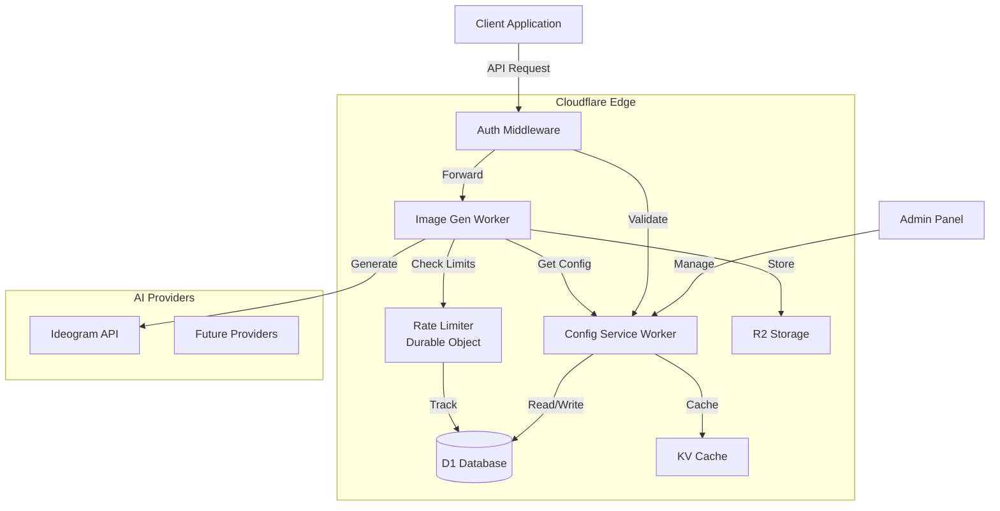
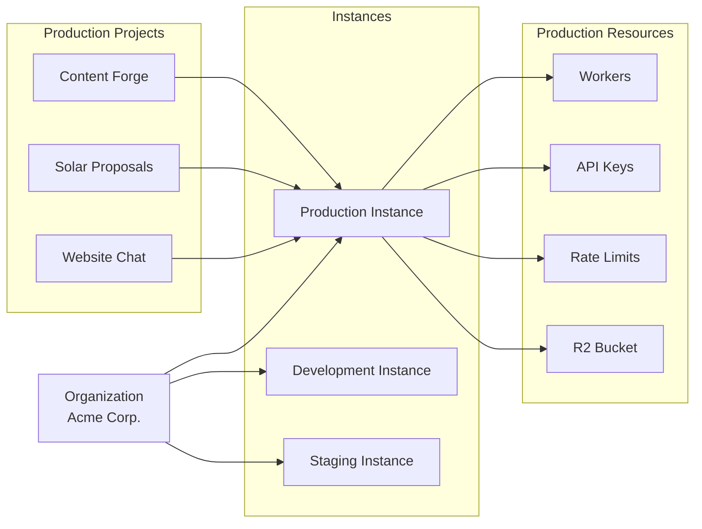
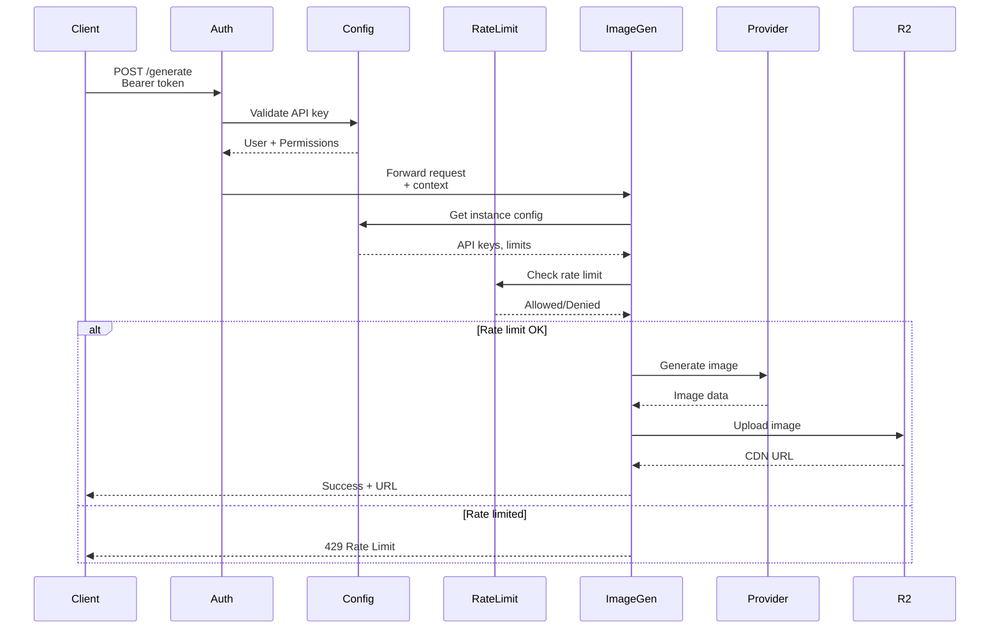

# Cloudflare Multi-Agent System Documentation

Welcome to the comprehensive documentation for the Cloudflare Multi-Agent Image Generation System.

## Table of Contents

- [Overview](#overview)
- [Architecture](#architecture)
- [Quick Start](#quick-start)
- [Documentation Sections](#documentation-sections)

## Overview

The Cloudflare Multi-Agent System is a scalable, provider-agnostic platform for AI-powered image generation built entirely on Cloudflare's edge infrastructure. It provides hierarchical instance management, rate limiting, and multi-provider support.

### Key Features

- **Hierarchical Architecture**: Organization → Instance → Project model
- **Provider-Agnostic**: Extensible framework for multiple AI providers (Ideogram, DALL-E, Midjourney, etc.)
- **Instance Isolation**: Each instance has dedicated workers, API keys, and rate limits
- **Rate Limiting**: Sophisticated Durable Objects-based rate limiting per instance
- **Edge-Native**: Runs entirely on Cloudflare Workers for global low-latency
- **Secure**: Encrypted API key storage, authentication middleware, instance isolation

### Tech Stack

- **Compute**: Cloudflare Workers (V8 isolates)
- **Database**: D1 (SQLite at the edge)
- **Storage**: R2 (object storage)
- **Cache**: KV (key-value store)
- **State**: Durable Objects (stateful coordination)
- **Language**: TypeScript
- **Testing**: Vitest
- **CI/CD**: GitHub Actions

## Architecture

### System Overview



### Instance Model



### Request Flow



## Quick Start

### Prerequisites

- Node.js 18+
- Cloudflare account
- Wrangler CLI: `npm install -g wrangler`

### Installation

```bash
# Clone repository
git clone https://github.com/YourOrg/cloudflare-multiagent-system.git
cd cloudflare-multiagent-system

# Install dependencies
npm install

# Configure environment
cp .env.example .env
# Edit .env with your credentials
```

### Local Development

```bash
# Run config service locally
cd infrastructure/config-service
wrangler dev

# Run image gen worker locally
cd workers/image-gen
wrangler dev
```

### Deploy

```bash
# Deploy database
npm run db:migrate

# Deploy workers
npm run wrangler:deploy

# Deploy admin interface
cd interfaces/admin-panel
npm run deploy
```

## Documentation Sections

### [API Reference](./api/README.md)
Complete API documentation for all endpoints with examples.

### [Deployment Guide](./deployment/README.md)
How to deploy instances, update workers, and troubleshoot issues.

### [Development Guide](./development/README.md)
Local development setup, adding providers, and testing.

### [Admin Guide](./admin/README.md)
Managing users, monitoring systems, and scaling.

### [Architecture Specs](./specs/architecture.md)
Detailed architecture specifications and design decisions.

### [API Contracts](./specs/api-contracts.md)
API contract specifications for all services.

## Support

- **Issues**: [GitHub Issues](https://github.com/YourOrg/cloudflare-multiagent-system/issues)
- **Discussions**: [GitHub Discussions](https://github.com/YourOrg/cloudflare-multiagent-system/discussions)

## License

MIT License - See [LICENSE](../LICENSE) for details

---

**Built with Claude Code** | **Powered by Cloudflare Workers** | **Autonomous Multi-Agent Development**
